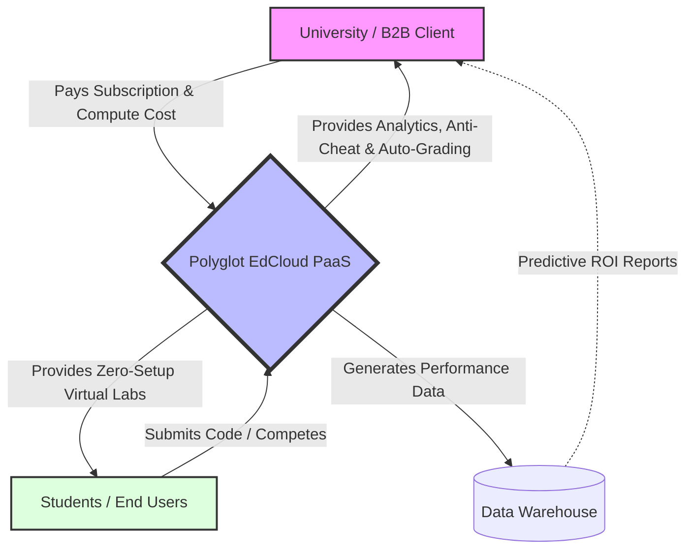
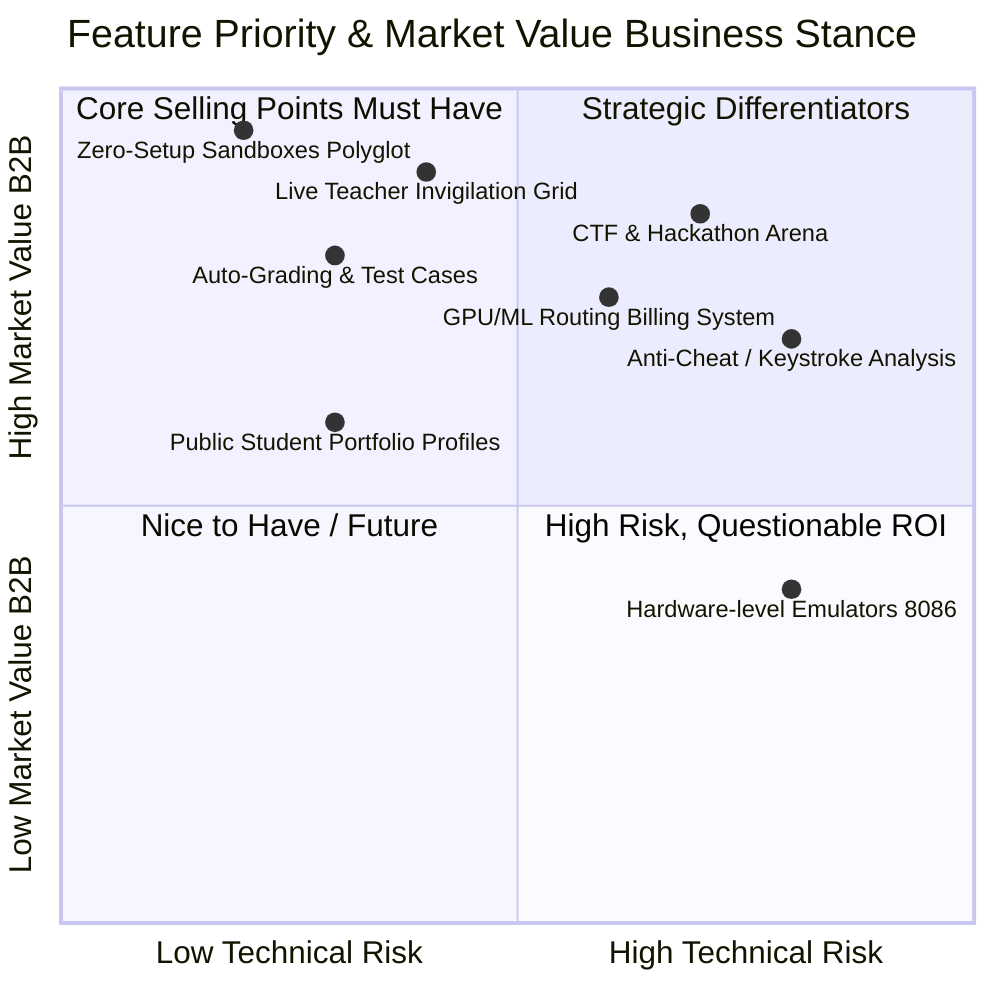
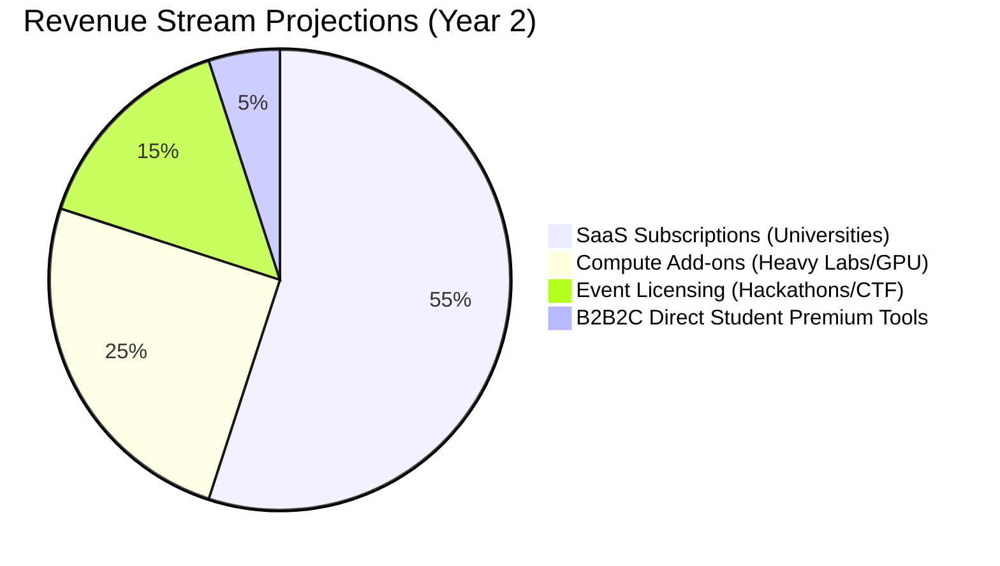

***Role: Chief Product Officer (CPO) & Lead Business Analyst (BA)*** 📊👔

Technical hat khule ekhon ami amar **Business Strategy & Product Management** hat porchi. SRE ba Architecture ekhon background-e thakbe. Amader main target ekhon ektai: **"How to sell this, who will buy this, and how it becomes a multi-million dollar SaaS business."**

Amra ekta B2B (Business-to-Business) SaaS (Software as a Service) platform dar koracchi, jar end-users holo students (B2B2C model). Niche tomar jonne ekta Industry-Grade Business Requirement Specification (BRS) toiri kore dilam.

---

# Business Requirement Specification (BRS)

**Product Name:** Polyglot EdCloud & Virtual Lab Platform

**Target Market:** Higher Education Institutions (Universities), Coding Bootcamps, and EdTech Companies.

**Business Model:** B2B SaaS (Subscription + Pay-as-you-go Compute)

## 1. Executive Summary & Business Vision

Bartoman education sector-e Computer Science, Engineering ar IT-related course-er demand sky-high. Kintu university-gulor ekta boro pain-point holo **Physical IT Infrastructure maintain kora**. Protita student-er PC-te IDE setup, compiler version match kora, ar cybersecurity/ML-er heavy workload chalanor jonno lab upgrade kora onnek khoroch-shapekkho ar painful.

Amader platform-er vision holo: **"Zero-Setup Virtual Labs for Institutions."** Ekta B2B platform jeta University-guloke enable korbe tader puro lab environment cloud-e shift korte. Teacher-ra class nibe, monitor korbe, evaluate korbe—ar students-ra browser theke heavy C++, Java, ML ba CTF (Cybersecurity) workloads run korbe.

---

## 2. B2B Business Model & Value Flow

Amra university-guloke software ta "Sell" korbo na, amra tader kache "Compute Time & Features" rent (vara) dibo.

* **Tier 1 (Basic Lab):** Standard Python, C++, Java execution. Billed per active student per month.
* **Tier 2 (Pro/AI Lab):** GPU-enabled ML workloads, Heavy GUI environments. Billed per compute hour.
* **Tier 3 (Arena/Events):** CTF, Hackathon, ar Coding Contest hosting. Event-based one-time billing.

---

## 3. Stakeholder Scenarios & Requirements (The "Why")

Ekta successful B2B platform banate hole buyer (University) ar user (Student) duijoner-i pain points solve korte hobe.

### 3.1. University & Teachers (The Buyers & Managers)

University authority ar teacher-der main focus holo **cost reduction, efficiency, ar academic integrity**.

* **Scenario A (Cost vs. IT Overhead):** HOD (Head of Dept) dekhte pacchen protita semester-e notun software (CUDA, Android Studio, nmap) install korar jonno IT team-ke weeks lagate hoy.
* *Requirement:* Cloud-based custom templates. Teacher just ekta dropdown theke "ML Lab Template" select korbe, ar 100 jon student-er jonno cloud-e environment ready hoye jabe instantly.

* **Scenario B (Student Evaluation & Auto-Grading):** Ekjon teacher-ke 150 student-er C++ assignment manually run kore check korte hoy, jeta huge time-consuming.
* *Requirement:* **Auto-Grader Engine**. Teacher test-cases (Hidden & Public) set kore dibe. Student code submit korlei platform automatically edge cases check kore mark boshiye dibe.

* **Scenario C (Monitoring & Anti-Cheat - "Google Classroom on Steroids"):** Exam ba lab test-er shomoy students-ra ChatGPT theke ba onno kono tab theke code copy korche kina, ta track kora mushkil.
* *Requirement:* **Live Invigilation Dashboard**. Teacher tar dashboard theke 50 jon student-er live terminal ba typing flow ekshathe grid-view te dekhte parbe. Kono student code copy-paste korle (typing speed anomaly) platform automatically "Plagiarism Flag" raise korbe.

### 3.2. Students (The End Users)

Student-ra chay friction-less experience. Tara complex setup-er jhamelay jete chay na.

* **Scenario A (Hardware Limitations):** Ekjon student-er laptop backdated (4GB RAM). She heavy ML training ba Android virtualization korte parche na.
* *Requirement:* Platform-er shob processing cloud-e hobe. Student jeno just ekta Chrome browser diyei smoothest experience pay, kono lag chara.

* **Scenario B (Gamification & Career Building):** Shudhu assignment submit kora boring. Students-ra real-world challenge chay.
* *Requirement:* **Public/Private Profiles & Badges**. Tara ki ki problem solve korse, tader success rate koto, sheta tader profile-e thakbe jeta tara tader CV ba LinkedIn-e share korte parbe.

---

## 4. Stakeholder Dependency & Feature Matrix

Nicher matrix-ti dekhachhe kivabe ekta feature er upor buyer ar user duijonei dependent ar tader business value koto.

---

## 5. Next-Level Platform Upgrades (The USP - Unique Selling Propositions)

Market-e already Replit ba HackerRank ache. Amader B2B model-ke alada korte hole amader platform-ke **"Academic OS"** hishebe position korte hobe.

### 5.1. The "Classroom & Lab" Module (Monitoring & Evaluation)

* **Live Instructor View:** Google Classroom-e jemon assignment deya hoy, ekhane assignment deyar por ekta "Live Session" shuru hobe. Teacher screen-e ekta matrix pabe (e.g., 5x5 grid for 25 students). Protita grid-e student-er IDE-er mini live-feed thakbe (powered by WebSockets). Teacher jekono ekjon-er box-e click kore tar live code typing dekhte parbe ar okhanei chat-e help korte parbe.
* **Behavioral Analytics:** Student code ta ki nije likhese naki ekshathe 500 line paste korese? Platform tar Keystroke Dynamics analyze kore teacher-ke "Trust Score" dibe.
* **Time-Travel Code Review:** Teacher chaile student-er code lekhar puro history ta ekta slider diye piche tene dekhte parbe (jemon Google Docs-er version history) jate boka jay she exactly kivabe problem ta solve korlo.

### 5.2. The "Arena" Module (CTF & Coding Competitions)

Educational institutes-er ekta boro branding hoy tader extracurricular activities diye. Amader platform-e built-in "Arena" thakbe.

* **Capture The Flag (CTF) Hosting:** University-ra nijera cybersecurity CTF host korte parbe. Amader platform K8s-er maddhome isolated vulnerable pods (challenges) toiri korbe. Students-ra pwn/exploit kore flag ber korbe. Dynamic scoring ar live leaderboard thakbe.
* **Inter-University Hackathons:** B2B approach-er ekta boro dik holo network effect. Ek university-r sathe arek university-r competition arrange korar full technical infrastructure amader platform dibe. Ete amader brand value organically spread hobe.

---

## 6. Commercialization & Revenue Architecture

Business hishebe dar korate hole technology-ke poishay convert korte hobe. Niche amader core revenue streams:

1. **SaaS Subscriptions (Recurring ARR):** University per student per semester e ekta fixed charge dibe (e.g., $10/student/semester). Eitar against-e tara basic cloud compile, auto-grading ar classroom features pabe.
2. **Compute Add-ons (Usage Based):** Jodi Data Science department "ML-Python with GPU" templates use korte chay, taderke Cloud GPU-er upor mark-up price (e.g., $0.50 per hour) pay korte hobe. Amader orchestration engine strictly track korbe kon dept koto hour GPU use korlo.
3. **Event Licensing (B2B Up-sell):** University jodi "Tech Fest" ba "National Hackathon" host korte chay platform use kore, tar jonno $500 - $2000 er event-specific enterprise license thakbe jekhane white-labeling (univerisity-r nijer logo) deya hobe.

---

## 7. Business Risks & Mitigation Strategies (SRE-Business Alignment)

Ekjon CPO hishebe platform-er technical risks-guloke business risk hishebe dekhte hobe:

* **Risk 1: Cloud Cost Overruns.** Student-ra jodi platform-e infinite loops (while true) chalaye rakhe, tahole cloud bill (AWS/GCP) bankrupt kore dibe business-ke.
* *Mitigation (Aligned with Core Philosophy):* Amader architecture-e pod-level `setrlimit` ar hard timeout (e.g., 5 seconds max runtime for basic tier) implement kora ache. Tai kono bhabei cost amader control-er baire jabe na.

* **Risk 2: Security Breaches (Especially in CTF module).** Student-ra intentionally malicious payload execute korbe. Tara main server hack korle university trust harabe.
* *Mitigation:* Zero-trust microservices. Every execution is an ephemeral, non-root K8s pod. Security is a sales pitch—we will sell the "Sandboxed Isolation" as our top-tier security feature to University IT boards.

---

### CPO's Final Verdict 🎯

Tech architecture hishebe amader foundation (Kubernetes, WebSockets, Polyglot Sandboxes) ekdom world-class. Kintu Business hishebe eta tokhoni hit hobe jokhon amra "C++ Compile kora jay" eita sell na kore, **"Teachers der hajar ghonta bachiye dibe ar cheating 0% e namiye anbe"** eita sell korbo.

The integration of Google Classroom-style live matrices and fully automated CTF/Hackathon arenas are our ultimate "hook" to onboard entire university departments rather than just individual students.
