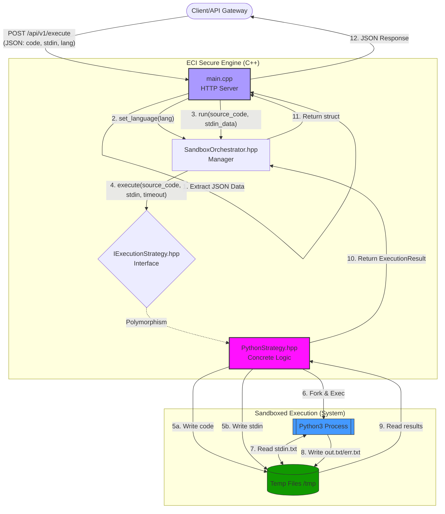

```mermaid
graph TD
    %% External Input
    Client([Client/API Gateway]) -- "POST /api/v1/execute<br/>(JSON: code, stdin, lang)" --> Main

    subgraph "ECI Secure Engine (C++)"
        Main[main.cpp<br/>HTTP Server]
        Orchestrator[SandboxOrchestrator.hpp<br/>Manager]
        IStrategy{IExecutionStrategy.hpp<br/>Interface}
        PythonStrat[PythonStrategy.hpp<br/>Concrete Logic]
    end

    %% Data Processing Flow
    Main -- "1. Extract JSON Data" --> Main
    Main -- "2. set_language(lang)" --> Orchestrator
    Main -- "3. run(source_code, stdin_data)" --> Orchestrator
    
    Orchestrator -- "4. execute(source_code, stdin, timeout)" --> IStrategy
    IStrategy -.->|Polymorphism| PythonStrat

    subgraph "Sandboxed Execution (System)"
        FS[(Temp Files /tmp)]
        Proc[[Python3 Process]]
    end

    %% Low Level Flow in PythonStrategy
    PythonStrat -- "5a. Write code" --> FS
    PythonStrat -- "5b. Write stdin" --> FS
    PythonStrat -- "6. Fork & Exec" --> Proc
    Proc -- "7. Read stdin.txt" <--> FS
    Proc -- "8. Write out.txt/err.txt" --> FS
    
    %% Result Backtrack
    FS -- "9. Read results" --> PythonStrat
    PythonStrat -- "10. Return ExecutionResult" --> Orchestrator
    Orchestrator -- "11. Return struct" --> Main
    Main -- "12. JSON Response" --> Client

    %% Styling
    style Main fill:#a9f,stroke:#333,stroke-width:2px
    style PythonStrat fill:#f1f,stroke:#333,stroke-width:2px
    style Proc fill:#49f,stroke:#333
    style FS fill:#190,stroke:#333
```
