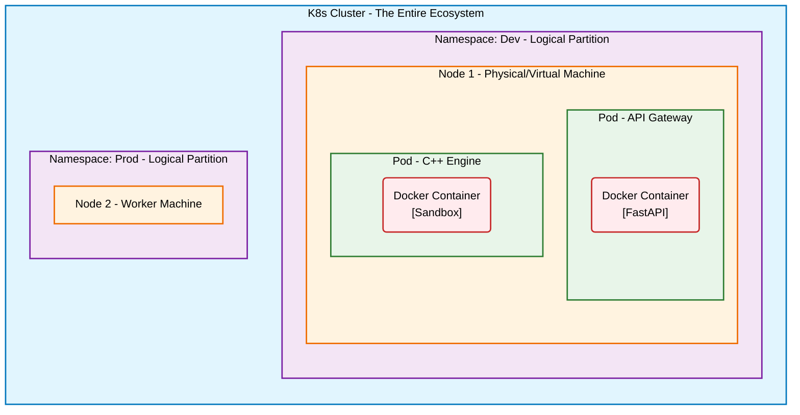

```mermaid
graph TD
    %% Styling
    classDef cluster fill:#e1f5fe,stroke:#0277bd,stroke-width:2px,color:#000
    classDef namespace fill:#f3e5f5,stroke:#7b1fa2,stroke-width:2px,color:#000
    classDef node fill:#fff3e0,stroke:#ef6c00,stroke-width:2px,color:#000
    classDef pod fill:#e8f5e9,stroke:#2e7d32,stroke-width:2px,color:#000
    classDef container fill:#ffebee,stroke:#c62828,stroke-width:2px,color:#000

    subgraph Cluster ["K8s Cluster - The Entire Ecosystem"]
        direction TB
        
        subgraph NS1 ["Namespace: Dev - Logical Partition"]
            direction TB
            
            subgraph Node1 ["Node 1 - Physical/Virtual Machine"]
                direction TB
                
                subgraph Pod1 ["Pod - API Gateway"]
                    C1("Docker Container<br>[FastAPI]"):::container
                end
                
                subgraph Pod2 ["Pod - C++ Engine"]
                    C2("Docker Container<br>[Sandbox]"):::container
                end
            end
        end
        
        subgraph NS2 ["Namespace: Prod - Logical Partition"]
            direction TB
            Node2["Node 2 - Worker Machine"]:::node
        end
    end

    %% Apply Classes
    Cluster:::cluster
    NS1:::namespace
    NS2:::namespace
    Node1:::node
    Pod1:::pod
    Pod2:::pod
```
