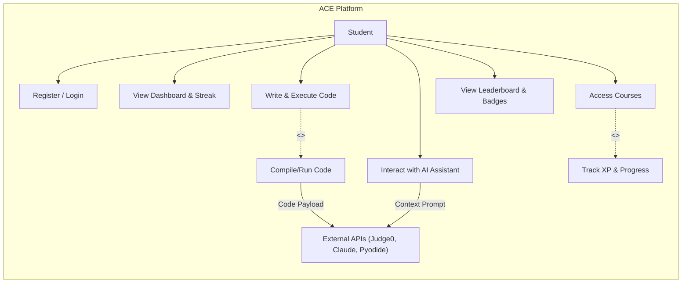
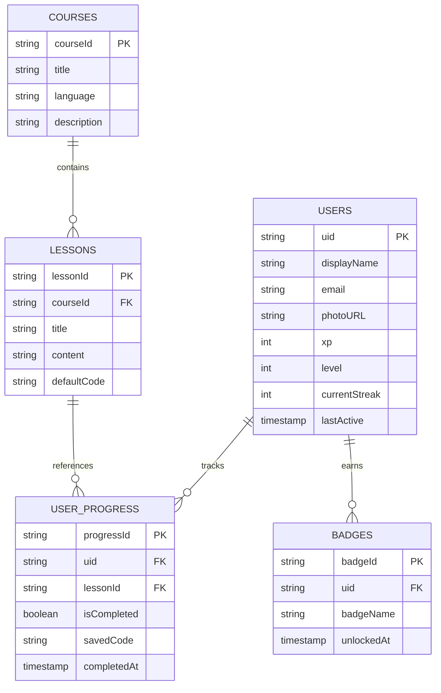

# Software Requirements Specification

### for

## ACE – Academic Coding Environment

**Version:** 1.0 (Final Codebase Alignment)
**Prepared by:** Elham Rafat Mahmud, Md. Fahim Hossain, Adnan Sami
**Institution:** University of Information Technology & Sciences (UITS)
**Submitted to:** Dhrubo Barua & Md. Faysal Sir
**Date:** May 20, 2026

---

## Table of Contents

1. Introduction
2. Overall Description
3. External Interface Requirements
4. System Features
5. Other Nonfunctional Requirements
6. Other Requirements
Appendix A: Glossary
Appendix B: Analysis Models

---

## 1. Introduction

### 1.1 Purpose

The purpose of this Software Requirements Specification (SRS) is to provide a complete and detailed description of the functional and non-functional requirements for the **ACE (Academic Coding Environment)** platform. This document serves as the blueprint for evaluating the final production state of the application built on Next.js, Firebase, and remote execution sandboxes.

### 1.2 Document Conventions

* **Bold text** is used to emphasize key terms, features, and system states.
* Monospace font is used for code references, API endpoints, and file names.
* UML Diagrams are provided in Appendix B using standard notation (Mermaid).

### 1.3 Intended Audience and Reading Suggestions

This document is intended for project evaluators, academic supervisors, and future developers. It is recommended to read the **Overall Description** for a conceptual overview before diving into specific **System Features** and **External Interface Requirements**.

### 1.4 Product Scope

ACE is a fully online web-based platform that integrates structured learning modules, interactive quizzes, a real code execution environment, and gamification features. It caters to beginner programmers learning Linux commands, Python, C, and C++.
**In Scope:** User authentication, modular tutorials, real-time code execution, AI-powered debugging, gamified XP and leaderboard systems.
**Out of Scope:** Offline code execution, native mobile applications, paid subscriptions.

### 1.5 References

* Next.js Documentation (Frontend Framework)
* Firebase Documentation (Authentication & Firestore Database)
* Judge0 API Documentation (C/C++ Execution Sandbox)
* Pyodide Documentation (Python WebAssembly Execution)
* Claude AI API Guidelines

---

## 2. Overall Description

### 2.1 Product Perspective

ACE is a standalone web application utilizing a serverless architecture. It operates independently but relies on third-party APIs for specific backend functions: Firebase for database and identity management, Vercel for hosting, Judge0 for compiled code execution, and Claude for AI assistance.

### 2.2 Product Functions

* **User Management:** Secure onboarding, authentication, and profile tracking.
* **Interactive Learning:** Split-pane interface for reading module content and writing code simultaneously.
* **Code Execution:** Compiles and runs C/C++ remotely, executes Python locally via client-side WebAssembly, and simulates Linux CLI.
* **Gamification:** Awards XP, badges, daily streaks, and dynamically updates a global leaderboard.
* **AI Assistance:** Context-aware AI for debugging errors and explaining code snippets.

### 2.3 User Classes and Characteristics

* **Students/Learners (Primary):** Undergraduate CSE students or beginners with zero to minimal programming experience seeking structured, gamified learning.
* **Administrators/Educators (Secondary):** Users capable of updating course modules and monitoring system integrity (via Firebase Console).

### 2.4 Operating Environment

* **Platform:** Web-based (Modern browsers: Chrome, Firefox, Safari, Edge).
* **Client Requirements:** JavaScript must be enabled. WebAssembly support is required for Python execution.
* **Server/Backend:** Node.js environment (Next.js API routes), Firebase Firestore cloud database.

### 2.5 Design and Implementation Constraints

* The system must remain fully online.
* Due to zero-cost operational goals, the platform is constrained by the free-tier limits of Vercel (hosting), Firebase (reads/writes), and Judge0/Claude APIs.
* Execution environments for C/C++ are strictly sandboxed with strict timeout limits to prevent infinite loops from draining server resources.

### 2.6 User Documentation

The platform features self-explanatory UI elements, onboarding tooltips, and a dedicated AI assistant to help users navigate features and debug code natively without external manuals.

### 2.7 Assumptions and Dependencies

* Users possess a stable internet connection.
* Users have access to a Google Account for OAuth login or a valid email address.
* The Judge0 API and Pyodide CDN remain operational and accessible.

---

## 3. External Interface Requirements

### 3.1 User Interfaces

The user interface is designed with a modern, responsive layout using Tailwind CSS. Below are the primary screens of the system:

* **Authentication & Landing:** Seamless login via Google or Email.

* **User Dashboard:** Central hub displaying level, XP, streaks, and course progress.

* **Course Selection:** Interface to select Linux, C, C++, or Python tracks.

* **Lesson Content View:** Modular reading material for the selected topic.

* **Code Editor & Execution:** Split-pane real-time editor with compilation output.

* **AI Debugger Panel:** Contextual AI interface for explaining and fixing code.

* **Badges & Achievements:** Gamification showcase.

* **Global Leaderboard:** Ranks users globally by XP.

* **Missions View:** Daily/Weekly coding challenges.

* **User Profile:** Detailed historical data and account management.

### 3.2 Hardware Interfaces

No specific hardware interfaces are required beyond a standard personal computer or mobile device capable of rendering modern web pages.

### 3.3 Software Interfaces

* **Firebase Auth & Firestore:** For managing user sessions and storing document-based application data (users, courses, progress, badges).
* **Judge0 REST API:** Receives base64 encoded C/C++ source code, executes it in a sandbox, and returns standard output/error.
* **Pyodide:** WebAssembly port of CPython loaded directly into the client browser to execute Python scripts without server-side processing.

### 3.4 Communications Interfaces

* All network communication is encrypted via HTTPS.
* Next.js API routes securely proxy requests to the Claude AI API to protect private keys.

---

## 4. System Features

### 4.1 Feature 1: Authentication & Progress Tracking

* **Description:** Secure user login and automatic syncing of completed lessons and code snippets.
* **Stimulus/Response:** User clicks "Sign in with Google" -> System authenticates via Firebase -> System fetches or creates Firestore profile -> Redirects to Dashboard.

### 4.2 Feature 2: Multi-Language Code Execution

* **Description:** Real-time sandboxed execution for different programming languages.
* **Stimulus/Response:** User writes code and clicks "Run".
* If Python: System executes via local Pyodide and renders output.
* If C/C++: System packages payload -> Sends POST request to Judge0 -> Awaits response -> Displays `stdout` or `stderr`.

### 4.3 Feature 3: AI-Assisted Debugging

* **Description:** Integrated Claude AI to analyze user code.
* **Stimulus/Response:** User encounters an error and clicks "Debug Error" -> System sends the current code, language, and error trace to `/api/ai` -> Claude generates a plain-text explanation and suggested fix -> UI displays the assistant's response.

### 4.4 Feature 4: Gamification Engine

* **Description:** System tracks interaction to award points, streaks, and badges.
* **Stimulus/Response:** User completes a lesson for the first time -> `xpService` triggers -> Updates Firestore -> Calculates level-ups -> Triggers toast notification UI for XP and Badge unlocks.

---

## 5. Other Nonfunctional Requirements

### 5.1 Performance Requirements

* Initial page loads must complete in under 2 seconds.
* Code execution requests to Judge0 must resolve within 3 seconds (excluding code containing intentional long delays or infinite loops, which will be killed by the sandbox timeout).
* WebAssembly loading for Python (Pyodide) must happen asynchronously to prevent UI blocking.

### 5.2 Safety Requirements

* The system must prevent data loss by auto-saving user code in the browser's local storage and syncing with Firestore upon successful compilation.

### 5.3 Security Requirements

* All user passwords (if email auth is used) are hashed by Firebase.
* Firestore Security Rules must strictly isolate user progress data (users can only write to their own `uid` documents).
* Code execution must remain strictly sandboxed (Judge0 isolated containers) to prevent malicious access to the server environment.

### 5.4 Software Quality Attributes

* **Modularity:** The codebase (`/app`, `/components`, `/lib`) is structured so new languages or courses can be added without overhauling core logic.
* **Usability:** High priority on intuitive navigation, utilizing a split-screen design to eliminate the need for users to switch tabs between reading and coding.

### 5.5 Business Rules

* Users can only gain XP for a lesson completion once. Subsequent completions do not award duplicate XP.
* Streaks reset to 0 if a user fails to execute at least one piece of code within a 24-hour UTC window.

---

## 6. Other Requirements

*(None specified at this time. Future iterations may include specific database scaling requirements as the user base grows.)*

---

## Appendix A: Glossary

* **BaaS:** Backend as a Service (e.g., Firebase).
* **Judge0:** An open-source, robust, and scalable online code execution system.
* **Pyodide:** A port of CPython to WebAssembly, enabling Python to run in the browser.
* **WebAssembly (Wasm):** A binary instruction format for a stack-based virtual machine, providing near-native performance for web applications.
* **XP (Experience Points):** The gamified currency used to measure a user's progress and rank on the platform.

---

## Appendix B: Analysis Models

### B.1 System Use Case Diagram

### B.2 Entity-Relationship Diagram (Firestore Data Model)

