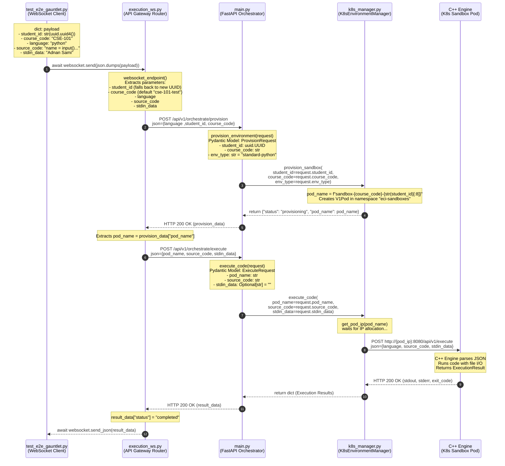

```mermaid
sequenceDiagram
    autonumber
    participant T as test_e2e_gauntlet.py<br>(WebSocket Client)
    participant W as execution_ws.py<br>(API Gateway Router)
    participant M as main.py<br>(FastAPI Orchestrator)
    participant K as k8s_manager.py<br>(K8sEnvironmentManager)
    participant P as C++ Engine<br>(K8s Sandbox Pod)

    Note over T: dict: payload<br/>- student_id: str(uuid.uuid4())<br/>- course_code: "CSE-101"<br/>- language: "python"<br/>- source_code: "name = input()..."<br/>- stdin_data: "Adnan Sami"
    
    T->>W: await websocket.send(json.dumps(payload))
    
    Note over W: websocket_endpoint()<br/>Extracts parameters:<br/>- student_id (falls back to new UUID)<br/>- course_code (default "cse-101-test")<br/>- language<br/>- source_code<br/>- stdin_data
    
    %% PROVISIONING PHASE %%
    W->>M: POST /api/v1/orchestrate/provision<br/>json={language ,student_id, course_code}
    
    Note over M: provision_environment(request)<br/>Pydantic Model: ProvisionRequest<br/>- student_id: uuid.UUID<br/>- course_code: str<br/>- env_type: str = "standard-python"
    
    M->>K: provision_sandbox(<br/>student_id=request.student_id,<br/>course_code=request.course_code,<br/>env_type=request.env_type)
    
    Note over K: pod_name = f"sandbox-{course_code}-{str(student_id)[:8]}"<br/>Creates V1Pod in namespace "eci-sandboxes"
    
    K-->>M: return {"status": "provisioning", "pod_name": pod_name}
    M-->>W: HTTP 200 OK (provision_data)
    
    %% EXECUTION PHASE %%
    Note over W: Extracts pod_name = provision_data["pod_name"]
    
    W->>M: POST /api/v1/orchestrate/execute<br/>json={pod_name, source_code, stdin_data}
    
    Note over M: execute_code(request)<br/>Pydantic Model: ExecuteRequest<br/>- pod_name: str<br/>- source_code: str<br/>- stdin_data: Optional[str] = ""
    
    M->>K: execute_code(<br/>pod_name=request.pod_name,<br/>source_code=request.source_code,<br/>stdin_data=request.stdin_data)
    
    Note over K: get_pod_ip(pod_name)<br/>waits for IP allocation...
    
    K->>P: POST http://{pod_ip}:8080/api/v1/execute<br/>json={language, source_code, stdin_data}
    
    Note over P: C++ Engine parses JSON<br/>Runs code with file I/O<br/>Returns ExecutionResult
    
    P-->>K: HTTP 200 OK (stdout, stderr, exit_code)
    K-->>M: return dict (Execution Results)
    M-->>W: HTTP 200 OK (result_data)
    
    Note over W: result_data["status"] = "completed"
    W-->>T: await websocket.send_json(result_data)
```
