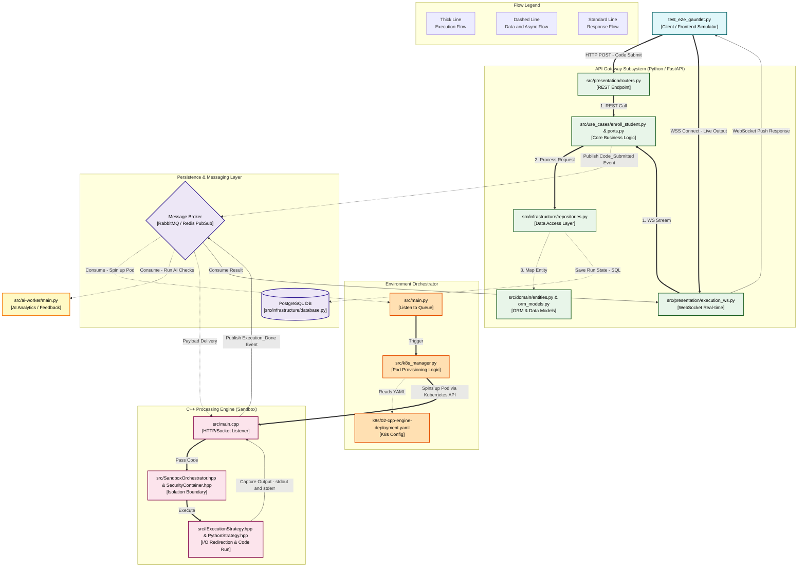

```mermaid
graph TD
    %% Styling Definitions
    classDef client fill:#e0f7fa,stroke:#006064,stroke-width:2px,color:#000
    classDef gateway fill:#e8f5e9,stroke:#1b5e20,stroke-width:2px,color:#000
    classDef k8s fill:#ffe0b2,stroke:#e65100,stroke-width:2px,color:#000
    classDef cpp fill:#fce4ec,stroke:#880e4f,stroke-width:2px,color:#000
    classDef data fill:#ede7f6,stroke:#311b92,stroke-width:2px,color:#000
    classDef ai fill:#fff9c4,stroke:#f57f17,stroke-width:2px,color:#000

    %% ----------------------------------------------------
    %% 1. CLIENT PROXY LAYER
    %% ----------------------------------------------------
    TestClient["test_e2e_gauntlet.py<br/>[Client / Frontend Simulator]"]:::client

    %% ----------------------------------------------------
    %% 2. API GATEWAY SUBSYSTEM
    %% ----------------------------------------------------
    subgraph ApiGateway ["API Gateway Subsystem (Python / FastAPI)"]
        direction TB
        Router["src/presentation/routers.py<br/>[REST Endpoint]"]:::gateway
        WS["src/presentation/execution_ws.py<br/>[WebSocket Real-time]"]:::gateway
        UseCase["src/use_cases/enroll_student.py & ports.py<br/>[Core Business Logic]"]:::gateway
        Repo["src/infrastructure/repositories.py<br/>[Data Access Layer]"]:::gateway
        Model["src/domain/entities.py & orm_models.py<br/>[ORM & Data Models]"]:::gateway
        
        %% Internal Gateway Flow
        Router ==>|1. REST Call| UseCase
        WS ==>|1. WS Stream| UseCase
        UseCase ==>|2. Process Request| Repo
        Repo -.->|3. Map Entity| Model
    end

    %% ----------------------------------------------------
    %% 3. ENVIRONMENT ORCHESTRATOR
    %% ----------------------------------------------------
    subgraph Orchestrator ["Environment Orchestrator"]
        direction TB
        EnvMain["src/main.py<br/>[Listen to Queue]"]:::k8s
        K8sMgr["src/k8s_manager.py<br/>[Pod Provisioning Logic]"]:::k8s
        Yaml["k8s/02-cpp-engine-deployment.yaml<br/>[K8s Config]"]:::k8s

        EnvMain ==>|Trigger| K8sMgr
        K8sMgr -.->|Reads YAML| Yaml
    end

    %% ----------------------------------------------------
    %% 4. CPP PROCESSING ENGINE
    %% ----------------------------------------------------
    subgraph CppEngine ["C++ Processing Engine (Sandbox)"]
        direction TB
        CppMain["src/main.cpp<br/>[HTTP/Socket Listener]"]:::cpp
        Sandbox["src/SandboxOrchestrator.hpp & SecurityContainer.hpp<br/>[Isolation Boundary]"]:::cpp
        Strategy["src/IExecutionStrategy.hpp & PythonStrategy.hpp<br/>[I/O Redirection & Code Run]"]:::cpp

        CppMain ==>|Pass Code| Sandbox
        Sandbox ==>|Execute| Strategy
    end

    %% ----------------------------------------------------
    %% 5. AI WORKER LAYER
    %% ----------------------------------------------------
    AIWorker["src/ai-worker/main.py<br/>[AI Analytics / Feedback]"]:::ai

    %% ----------------------------------------------------
    %% 6. PERSISTENCE & MESSAGING LAYER
    %% ----------------------------------------------------
    subgraph Persistence ["Persistence & Messaging Layer"]
        DB[("PostgreSQL DB<br/>[src/infrastructure/database.py]")]:::data
        Broker{"Message Broker<br/>[RabbitMQ / Redis PubSub]"}:::data
    end

    %% ====================================================
    %% SYSTEM-WIDE CONNECTIONS & LIFECYCLE FLOW
    %% ====================================================
    
    %% Request Initialization
    TestClient ==>|HTTP POST - Code Submit| Router
    TestClient ==>|WSS Connect - Live Output| WS

    %% Gateway to DB & Broker
    Repo -.->|Save Run State - SQL| DB
    UseCase -.->|Publish Code_Submitted Event| Broker

    %% Async Broker Fan-out
    Broker -.->|Consume - Spin up Pod| EnvMain
    Broker -.->|Consume - Run AI Checks| AIWorker

    %% K8s Provisioning the Sandbox
    K8sMgr ==>|Spins up Pod via Kubernetes API| CppMain

    %% Code Delivery & Execution
    Broker -.->|Payload Delivery| CppMain

    %% Return & Output Flow (Response Lifecycle)
    Strategy -->|Capture Output - stdout and stderr| CppMain
    CppMain -->|Publish Execution_Done Event| Broker
    Broker -->|Consume Result| WS
    WS -->|WebSocket Push Response| TestClient

    %% ====================================================
    %% LEGEND
    %% ====================================================
    subgraph Legend ["Flow Legend"]
        direction LR
        L1["Thick Line<br/>Execution Flow"] ~~~ L2["Dashed Line<br/>Data and Async Flow"] ~~~ L3["Standard Line<br/>Response Flow"]
    end
```